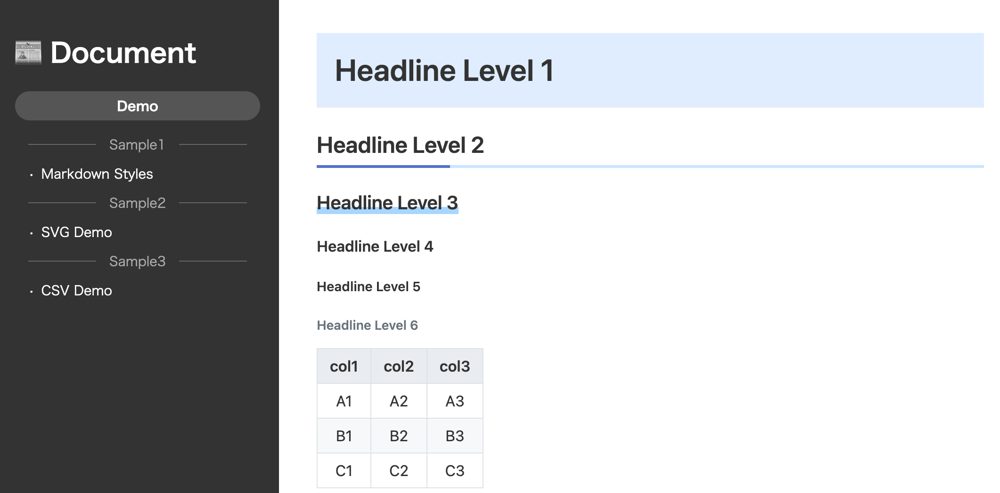

# Description

Markdown, CSV, SVGから構成された軽量ドキュメントをWEB上で参照可能なhtmlページに変換します。

# Features

- Markdownファイル（.md）をhtmlに変換
- CSVファイル（.csv）をhtmlのテーブル形式に変換
- SVGファイル（.svg）を拡大・移動可能な画像ビューア形式に変換

# Demo

https://tikamoto.github.io/doc-publisher/index.md.html



※変換元のファイル ⇒ [docs_src](./docs_src/)

# Requirement

- Node >= 18.16

# Installation

```
npm install
```

# Configuration

### app.json

```
{
  "name" : "Sample Documents"
  "srcDir" : "./docs_src",
  "distDir" : "./docs"
}
```
|key|type|value|
|:--:|:--:|:--|
|name|string|ドキュメントの名前（ビルドされたhtmlのtitle属性に反映）|
|srcDir|string|ドキュメントのソースディレクトリ|
|distDir|string|ビルド先のディレクトリ|

# Usage

### ビルド

```
npm run build
```

`srcDir`で指定されたディレクトリ内のドキュメントファイル（md, csv, svg）をhtmlに変換し`distDir`で指定されたディレクトリに出力します。

### テンプレートファイル

テンプレートファイルを編集することで変換後のhtmlのスタイルを任意に変更することができます。

|テンプレート|内容|
|:--|:--|
|`assets/page.html`|MarkdownおよびCSVファイルのhtml変換用テンプレートファイル|
|`assets/viewer.html`|SVGファイルの画像ビューア用テンプレートファイル|

### 目次

`srcDir`直下のindex.mdが目次として使用され、変換後のhtmlの左サイドメニュー表示に反映されます。